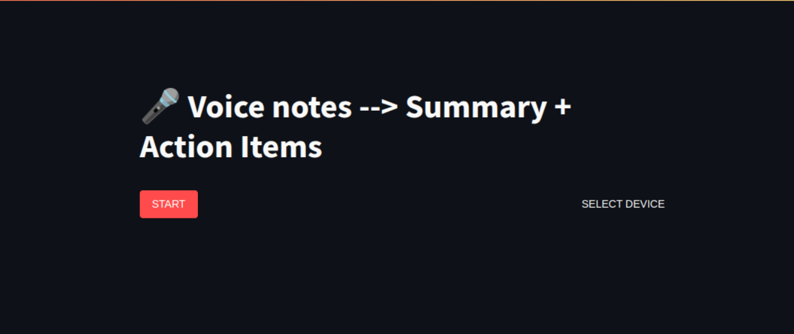

# [voice-notes-to-summaries](https://github.com/devvienxyz/voice-to-insights)

Record voice notes -> Summaries

[](https://codecov.io/gh/devvienxyz/voice-to-insights)

Warning: This is still in progress.

## Quick Demo

[](/assets/demo.webm)

## Setup

This project uses [pre-commit](https://pre-commit.com/) to ensure code quality and consistency.

The precommit setup step is included in the setup script.

```bash
./scripts/setup.sh
```

## Development

```bash
./start.sh
```

App is served at <http://localhost:8501>

## Testing

```bash
tox              # run all
tox -e lint      # lint and format check (ruff)
tox -e typecheck # static type checking (mypy)
tox -e py311     # run tests
tox -- -m unit
tox -av          # list available environments
tox -e py311 -- app/tests/test_core.py  # run a single test file
tox -- app/tests/test_core.py::test_process_audio_frames_with_existing_buffer  # run a single test
```

## Support my work

If you find my projects helpful, consider supporting me:

<a href="https://www.buymeacoffee.com/devvienxyz" target="_blank">
  
</a>
